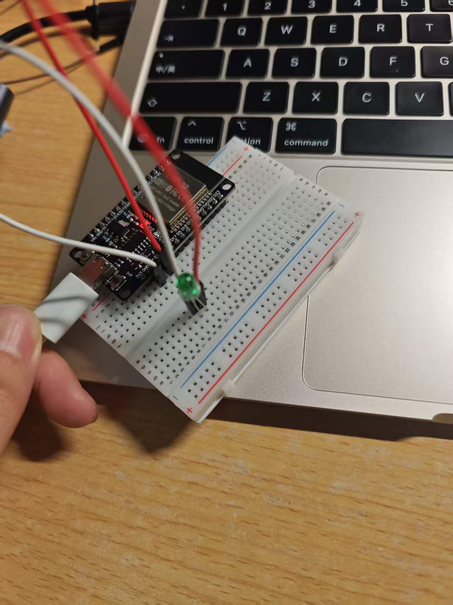
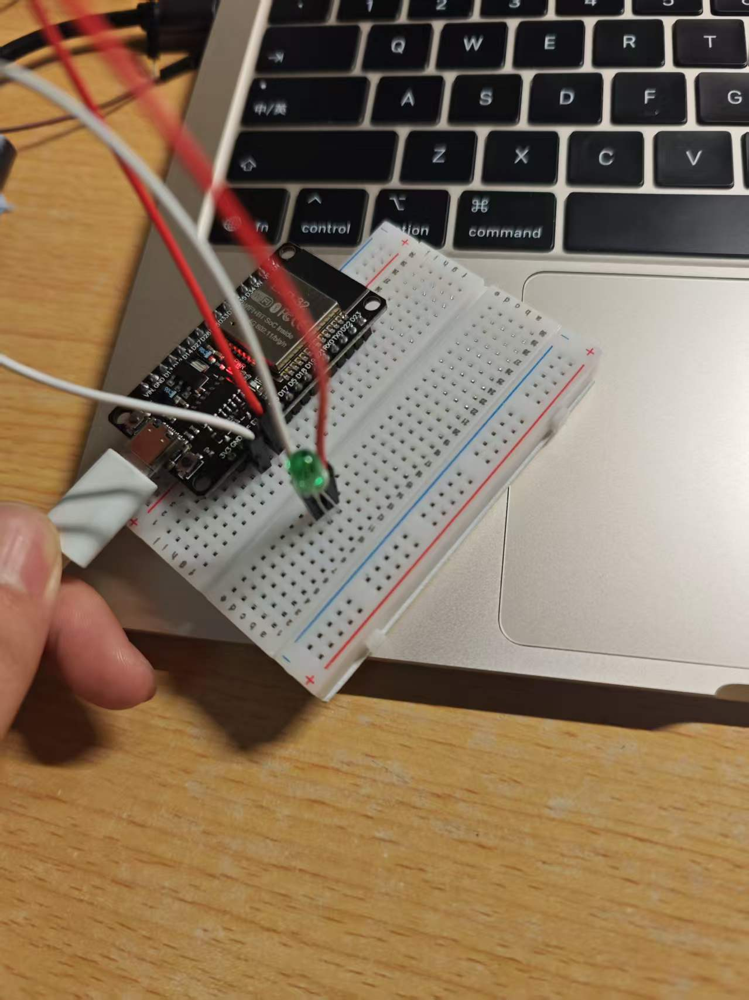
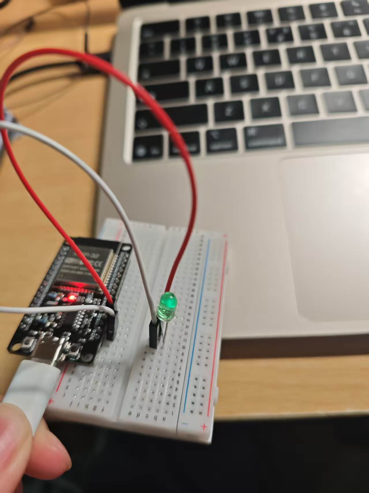
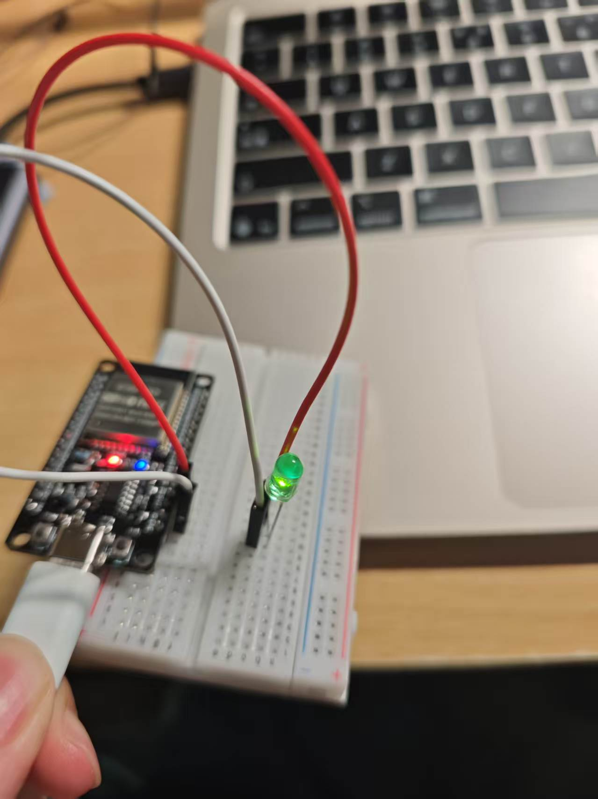

# 作业汇总

## ex01 — C 语言基础

### hello.c — 基础版
最简单的 Hello World 程序，直接输出 "Hello, World!"。

### input.c — 函数版
在 Hello World 基础上增加了函数封装：

- `getInput()` — 获取用户键盘输入
- `showOutput()` — 显示输出用户输入的内容
- `main()` — 调用上述两个函数完成输入输出

---

## lab01 — ESP32 Arduino 编程入门

### 1.ino — Hello ESP32

使用 Arduino 框架控制 ESP32 板载 LED（GPIO 2）以 1 秒为间隔闪烁，并通过串口输出 "Hello ESP32!"。

- `setup()` — 初始化串口（波特率 115200），设置 LED 引脚为输出模式
- `loop()` — 循环控制 LED 亮灭，每次延时 1 秒

---

## lab02 — delay() 方式 LED 控制实验

### 2/sketch_jun12a.ino — LED 闪烁（delay 方式）

使用 `delay()` 函数控制 ESP32 板载 LED（GPIO 2）以 1 秒为间隔闪烁，并通过串口输出状态信息。

- `setup()` — 初始化串口（波特率 115200），设置 LED 引脚为输出模式
- `loop()` — 循环控制 LED 亮灭，每次切换后 `delay(1000)`，并通过 `Serial.println()` 输出 "LED ON" / "LED OFF"




### SOS_light/SOS_light.ino — SOS 摩斯电码信号灯（delay 方式）

使用 `delay()` 函数控制 ESP32 板载 LED 发送 SOS 求救信号（摩斯电码：`... --- ...`）。

- `shortBlink()` — 短闪烁（200ms 亮 / 200ms 灭），表示摩斯电码的 `.`
- `longBlink()` — 长闪烁（600ms 亮 / 200ms 灭），表示摩斯电码的 `-`
- `loop()` — 循环发送 S（短闪×3）→ O（长闪×3）→ S（短闪×3），字母间隔 500ms，单词间隔 2000ms


---

## lab03 — PWM LED 呼吸灯实验

### 3/3.ino — LED 呼吸灯

使用 ESP32 的 `ledcAttach()` / `ledcWrite()` PWM（脉宽调制）功能控制板载 LED（GPIO 2）实现呼吸灯效果。

- `setup()` — 初始化串口，使用 `ledcAttach()` 绑定 GPIO 2，设置 PWM 频率 5000Hz、8 位分辨率（0-255）
- `loop()` — 通过 `ledcWrite()` 逐步调节占空比，实现 LED 渐亮→渐暗→渐亮的呼吸效果，每次循环后串口输出 "Breathing cycle completed"


---

## ex02 — millis() 函数 LED 1Hz 闪烁

### sketch_jun21a.ino — 非阻塞式 LED 1Hz 闪烁

使用 `millis()` 函数替代 `delay()` 实现非阻塞式 LED 1Hz 闪烁（亮 500ms / 灭 500ms）。

- `setup()` — 设置 LED 引脚（GPIO 2）为输出模式
- `loop()` — 通过 `millis()` 获取系统运行时间，每 500ms 翻转一次 LED 状态，实现 1Hz 精确闪烁，不会阻塞其他代码执行

```cpp
unsigned long previousMillis = 0;
const unsigned long interval = 500;  // 1Hz = 500ms on, 500ms off
bool ledState = LOW;

void loop() {
  unsigned long currentMillis = millis();
  if (currentMillis - previousMillis >= interval) {
    previousMillis = currentMillis;
    ledState = !ledState;
    digitalWrite(LED_PIN, ledState);
  }
}
```




---

## ex03 — millis() 函数 LED SOS 信号灯

### sketch_jun21a.ino — 非阻塞式 SOS 摩斯电码信号灯

使用 `millis()` 函数配合数组驱动的状态机，实现非阻塞式 SOS 信号灯（摩斯电码：`... --- ...`）。

- `ledPattern[]` — bool 数组描述 18 个 LED 亮/灭状态序列（S：短闪×3 → O：长闪×3 → S：短闪×3）
- `durationPattern[]` — 对应每个状态的持续时间（ms）：短亮 200ms、短灭 200ms、长亮 600ms、字母间隔 600ms、SOS 间隔 2000ms
- `setup()` — 设置 LED 引脚（GPIO 2）为输出模式
- `loop()` — 通过 `millis()` 判断当前状态持续时间是否结束，自动切换到下一状态，循环播放 SOS 序列

```cpp
bool ledPattern[] = {
  true, false, true, false, true, false,  // S: · · ·
  true, false, true, false, true, false,  // O: — — —
  true, false, true, false, true, false   // S: · · ·
};
unsigned long durationPattern[] = {
  DOT_TIME, SYMBOL_GAP, DOT_TIME, SYMBOL_GAP, DOT_TIME, LETTER_GAP,
  DASH_TIME, SYMBOL_GAP, DASH_TIME, SYMBOL_GAP, DASH_TIME, LETTER_GAP,
  DOT_TIME, SYMBOL_GAP, DOT_TIME, SYMBOL_GAP, DOT_TIME, SOS_GAP
};
```


---

## ex04 — ESP32 触摸自锁开关

### sketch_jun30a.ino — 触摸自锁开关

利用 ESP32 电容触摸传感器（T0 / GPIO4）实现触摸自锁开关：
摸一下 LED 亮并保持，再摸一下 LED 灭并保持。

- **`touchRead(T0)`** — 读取电容触摸值
- **阈值判定** — 触摸时数值下降，阈值 400
- **软件防抖** — 80ms 防抖延迟
- **边缘检测** — 只在"未触摸 → 触摸"瞬间翻转 LED

---

## ex05 — 多档位触摸调速呼吸灯

### sketch_jun30a.ino — 触摸调速呼吸灯

融合触摸引脚与 PWM 呼吸灯，每触摸一次在 1（慢）→ 2（中）→ 3（快）→ 1 之间循环切换呼吸速度。

- `handleTouch()` — 触摸检测 + 档位切换
- `updateBreath()` — 根据档位更新呼吸灯（间隔 25ms / 8ms / 1ms）
- `analogWrite()` — ESP32 PWM 控制亮度

---

## ex06 — 警车双闪灯效

### sketch_jun30b.ino — 双通道 PWM 反相渐变

两个 LED 反相渐变，实现警车双闪效果（A 渐亮时 B 渐暗）。

- GPIO18（PWM 通道 0）、GPIO19（PWM 通道 1）
- 反相输出：`dutyA = x`，`dutyB = 255 - x`
- 兼容 Arduino Core 2.x / 3.x

---

## ex07 — Web 网页端无极调光器

### sketch_jun30a.ino — 网页实时调光

手机/电脑连接 ESP32 热点后，通过浏览器访问网页，滑动条实时控制 LED 亮度。

- **WiFi AP**：`ESP32-DIMMER` / `192.168.4.1`
- **WebServer + AJAX**：前端 Fetch API 实时发送亮度值
- **PWM 无极调节**：0-255

---

## ex08 — 物联网安防报警器

### sketch_jun30c.ino — Web 布防/触摸报警

网页端布防/撤防，布防状态下触摸引脚触发报警锁定，LED 高频闪烁。

- **WiFi AP**：`ESP32-ALARM` / `192.168.4.1`
- **状态机**：未布防 → 已布防 → 报警中
- **HTTP 路由**：`/`、`/arm`、`/disarm`、`/status`
- **报警 LED**：80ms 间隔高频闪烁

---

## ex09 — 实时传感器 Web 仪表盘

### sketch_jun30d.ino — AJAX 实时数据仪表盘

网页端每 200ms 通过 AJAX 轮询 ESP32 `touchRead()` 数据，实时数值显示 + 进度条可视化。

- **WiFi AP**：`ESP32-DASHBOARD` / `192.168.4.1`
- **数据接口**：`/touch`（纯文本）、`/touchJson`（JSON）
- **前端**：`setInterval()` 定时 AJAX 轮询 + CSS 进度条
