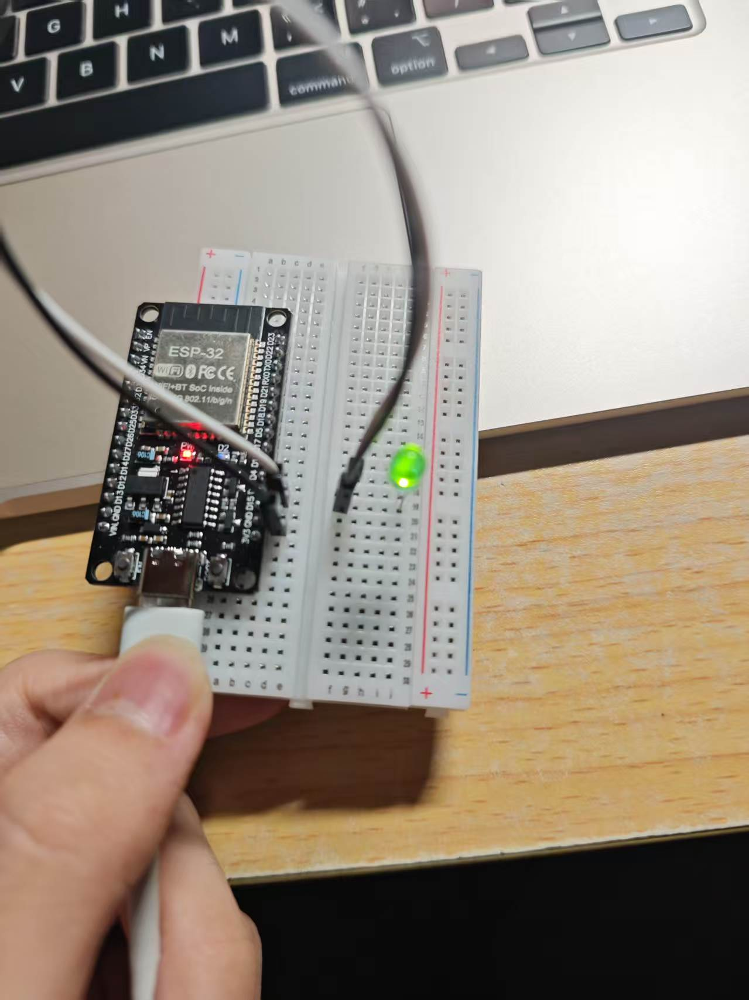

# lab01 — ESP32 Arduino 编程入门

## 1/1.ino — Hello ESP32

控制板载 LED（GPIO 2）以 1 秒为间隔闪烁，并通过串口输出 "Hello ESP32!"。

```cpp
#define LED_PIN 2

void setup() {
  Serial.begin(115200);
  pinMode(LED_PIN, OUTPUT);
}

void loop() {
  Serial.println("Hello ESP32!");
  digitalWrite(LED_PIN, HIGH);
  delay(1000);
  digitalWrite(LED_PIN, LOW);
  delay(1000);
}
```


